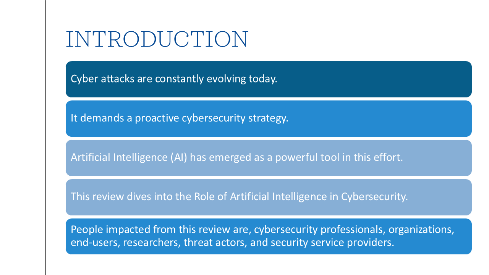

# AI in Cybersecurity — Literature Review

This repository contains a literature review paper prepared as part of the Introduction to Information Security Analytics academic module. The abstract of the paper is included here, but the full paper is not provided. Below, you will find a summary of the paper’s key content.

## Abstract

The advent of Artificial Intelligence (AI) has brought forth a paradigm shift in the realm of cyber security. This literature review delves into the multifaceted landscape of AI's transformative impact on safeguarding digital environments. Through a comprehensive analysis, it navigates through the fundamental principles of cyber security, elucidates the evolving spectrum of cyber threats, evaluates existing solutions, and explores the profound integration of AI technology. Furthermore, this review synthesizes findings from prior AI-driven research endeavors, uncovering trends and advancements in the field. With a forward-looking perspective, it envisions the future of cyber security, highlighting innovative AI-based approaches that promise to fortify digital defense mechanisms. This exploration underscores the pivotal role of AI in reshaping the cyber security landscape, offering invaluable insights for researchers, practitioners, and policymakers alike. 

## Introduction

 

## Literature Review

 

 

 

## AI Based Solutions

 

 

 

## Future Work

## Keywords

Artificial Intelligence, Cybersecurity, Machine Learning, Deep Learning, Conversational AI

💡This review is useful for anyone interested in AI’s impact on cybersecurity. Read the full paper : [Click here](https://drive.google.com/drive/folders/195H2O3UEjLoqNa_BHFwrJgzpUF4Af_XE?usp=drive_link)

